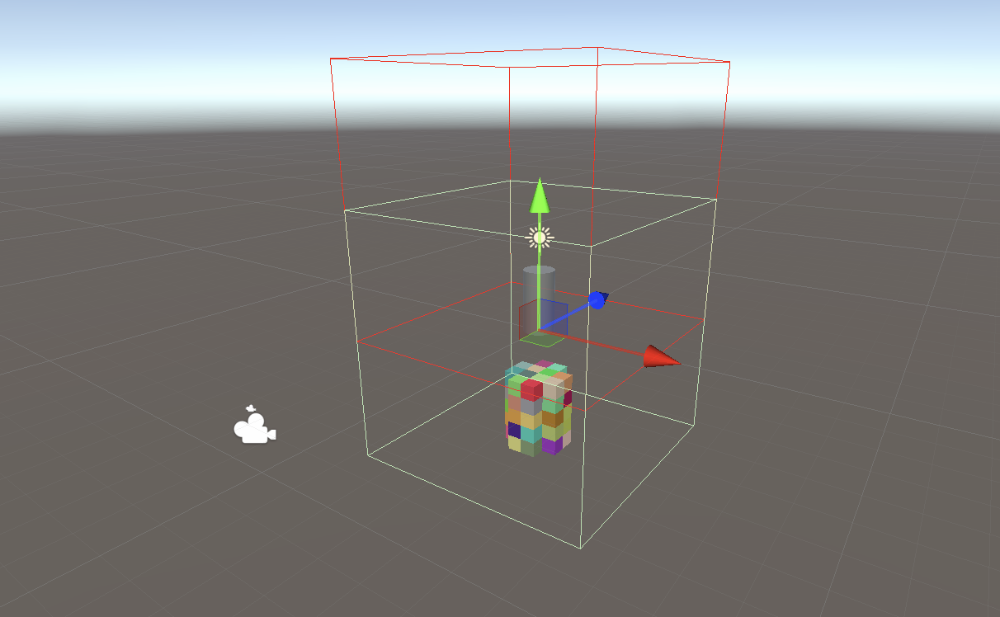
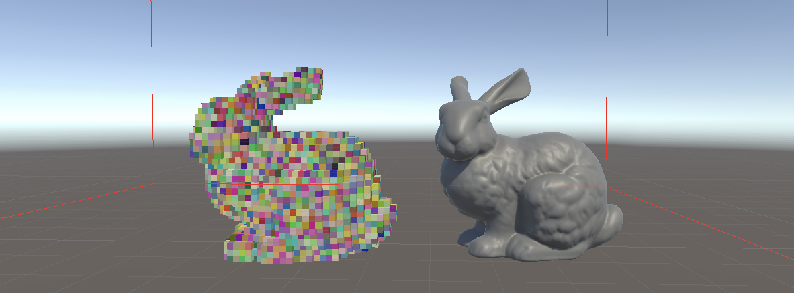
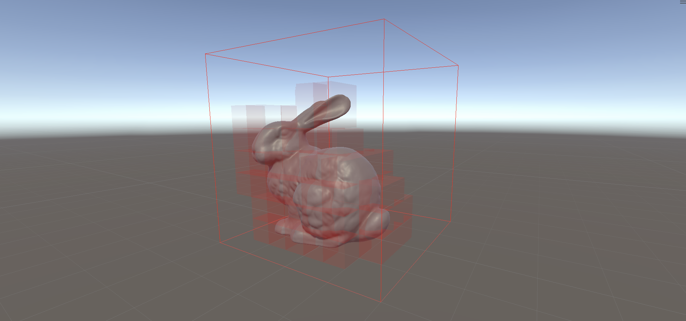
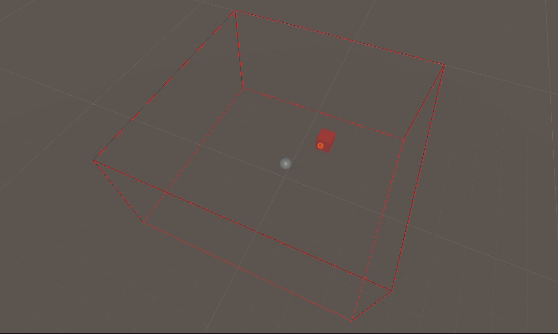

# Sessions
Details descriptions, thoughs and snippets.

## Sessions 2024-11-05: Setting up environment
- Setup the basic Boids algorithm
- The code documentation in WIP

<div style="display: flex; justify-content: space-around; align-items: center;">
    
    
</div>


### Next steps
- Review voxel grid from Acerola's work, evaluate adding it vs own implementation
- Add the sensing Ray to the boids
- Add the Ray-Voxel intersection test

Here is the corrected version of your README report:

---

## Session 2024-11-06: Evaluate How to Incorporate a Voxelizer

### Questions to be Answered:
- What’s the entry point?
- How do the C# script and compute shader communicate?
- How to create just one voxel using this method?
- How to detect if the voxel has intersected geometry?
- How to detect if the voxel is an obstacle in this method?

### Steps in the Algorithm
``` bash
In C#
1. Create a bounding volume at the center of the scene, and define its width, height, and depth.
2. Define the size of a voxel and compute the resolution along the width, height, and depth axes.
3. Gather all the geometry to voxelize.
4. For each mesh do:
    allocate memory (create the buffers) to store the triangles and vertices count.
5. Set all the variables in the Compute Shader that the GPU will need to reconstruct the scene, for instance the LocalToWorldMatrix
6. Dispatch the voxelization kernel to the GPU for each of the meshes we want to voxelize.
    Distribute the load between the threads

In the GPU:
1. Create the AABB representing a voxel. It extends beyond the size of the voxel by an _IntersectionBias.
2. Build each triangle of the given mesh and apply the transformation matrix.
3. Once ready, run the intersection test between the AABB and the triangle.
4. If true, flag the triangle as 1.
5. Repeat this until all the triangles are tested against the AABB of a voxel.
```

### Doubts and Bugs
- The voxelized representation of the mesh seems to be constructed, or at least visualized, without the proper transformation. Something might be off when passing the matrix, or the deprecated graphics method `DrawMeshInstancedIndirect` could be causing trouble.


### Next Steps
- Fix unwanted behavior from the matrix.
- Query the position of a voxel using the voxelized representation; return 1 if it is an obstacle.

**Reference**
- [1] Acerola, "I Tried Recreating Counter Strike 2’s Smoke Grenades," (2023). Accessed: Nov. 06, 2024. [Online Video]. Available: https://www.youtube.com/watch?v=ryB8hT5TMSg

---

## Session 2024-11-07: Fixing offset

### Questions to be Answered:
- Where in the pipeline the offset could happend?
> The offset is taking place in two stages, in the CPU when instantiating the Bound. And inside the kernel
```C#
Vector3 boundsSize = boundsExtent * 2;
debugBounds = new Bounds(new Vector3(0, boundsExtent.y, 0), boundsSize);
```

- What is causing the offset?
> Upon further analisis, the problem lies in the voxelization kernel; the center of the AABB was not correctly translated into the Y-axis.
```C
centerPos.xz -= _BoundsExtent.xz;
centerPos.y  -= _BoundsExtent.y; // This instruction was missing

// New version
centerPos.xzy -= _BoundsExtent.xzy;
```
The voxelizer is now working as expected.


There is still a problem when debugging the total volume

## Session 2024-11-07: Querying a Voxel and Correcting My Mistake

### Questions to be Answered:
- Who owns the voxel grid?
> Technically the CPU, and the GPU recieves the buffers that need to be computed or used to render
- How to query a position?
> We take the world position, transform to the reference of the bounding volume, and then mapping that transpform 3D position into a 1D.
- Who visualizes the voxels?  
> The shader visualization is a collaborative effort between the compute shader and the vertex/fragment shader.

*The URP translation may have been done incorrectly, potentially causing the offset.*

The bounding volume $$B$$ is defined by a half-vector $$h$$ and its center $$c$$.  
From this, we derive the $$a_{min}$$ and $$a_{max}$$ points that represent the AABB:  
$$ c = \frac{a_{min} + a_{max}}{2} $$  
$$ h = \frac{a_{max} - a_{min}}{2} $$

* Update: Found my error. The compute shader and C# script were not causing the strange offset. The real issue was in the vertex shader. When transforming the mesh (cube) to match the size and location of the voxels, the shader was translating the voxel by the half-diagonal, including the Y-axis. However, since the voxel already starts at Y=0, only the XZ translation was needed. 


**New kernel** to query the position of a point inside the voxel

``` C
[numthreads(1,1,1)]
void CS_QueryPosition(uint id : SV_DISPATCHTHREADID)
{
    float3 pointPos = _Point % (_BoundsExtent * 2.0);
    pointPos.xz += _BoundsExtent.xz; 
    pointPos /= _BoundsExtent * 2;
    pointPos *= _VoxelResolution;

    _Voxels[to1D(pointPos)] = 1;
}
```



### Next steps:
- The Ray-AABB will yield several intersection points as the ray pierces the voxels.
- The GPU will have to tell the CPU back that one of the intersections has found an obstacle `voxel = 1`, so the boid can react.
- The GPU will have to create a simple ray definition and perform the intersection test. The origin of the ray is given by the `position` of the boid and the `direction` by the `velocity * reach`.
- A new kernel is needed to perform the computations. The challenge will be to determine a balanced number of thread groups.
- The simpliest implementation could be: Create an intersection test that goes from point `A` to point `B`, and render all the voxels that are intersected.

## Session 2024-11-08: Simple ray-aabb intersection

- **Objective:** Create an intersection test that goes from point `A` to point `B`, and render all the voxels that are intersected.

- Something happend in the C#, and the compute shader stoped working. Apparently, having no geometries to voxelize creates a bug. And it does not allows for queries any more. I will have to check this.