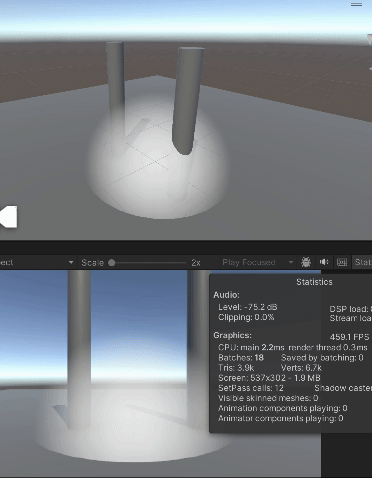

# Volume rendering sessions

## Session 2024-11-17: A simple ray marcher
- **Objective:** Ray march inside a bounding volume to compute colors

[Following this article](https://www.alanzucconi.com/2016/07/01/volumetric-rendering/)

- `VolumeRender_AZt1.shader` : Alan Zucconi test 1
### Learnings
- For localized volume rendeing, Sign Distance Functions (SDF)  can help the ray marching technique compute the distance to the volume where the participating media is. So it doe snot need to march through the void until it reaches the bounding volume.
- `OnRenderImage()` Does not work for URP. Use [this instead](https://docs.unity3d.com/Packages/com.unity.render-pipelines.universal@17.0/api/UnityEngine.Rendering.Universal.ScriptableRenderPass.html). Here's an [article](https://www.cyanilux.com/tutorials/custom-renderer-features/) about it.



## Session 2024-12-02: Imploving smoke shape
- **Objective:** Explore how the shape from the sampled noise can be distorted to improve the look of the smoke.
```C++
float f = _Time * _Frequency;
return _SmokeScale * (noise(     0.1 * _SmokeScale * p.x - f,
                                       _SmokeScale * p.y - (f * 1.0), 
                                 0.5 * _SmokeScale * p.z + (f * 2.0)) + 1.0) * 0.5;
```
Adding independent scalar values (`0.1` and `0.5`) to the positions of the sample improved the look:


An improvement from prevoius version:

